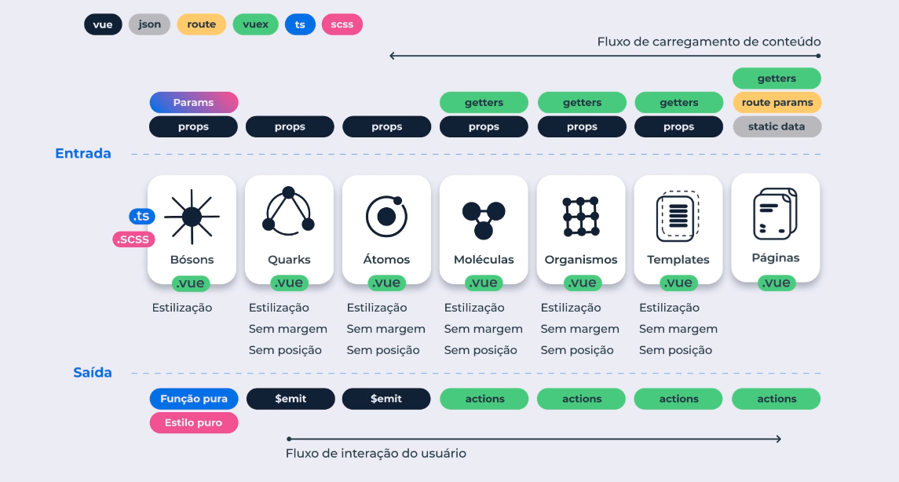

## Princípios do Atomic Design

Este repositório tem o objetivo de reunir principios do Atomic Design aprendidos no bootcamp da [Cataline](https://www.cataline.io/).

### Bósons
- Elementos abstratos como animações, paleta de cores, grid layout;

### Quarks
- Detalhes como setas para navegação de um slider, mensagens de erro etc;

### Átomos
- Elemento indivisível em uma interfáce grávica.
Ex.: tags HTML, imagens, textos, inputs, buttons etc;

### Moléculas
- 2 ou mais átomos mantidos juntos para funcionarem com o mesmo propósito.
Ex.: input + button forma a molécula de busca com a finalidade de realizar buscas em uma interface gráfica;

### Organismos
- 2 ou mais moléculas juntas que alteram o conteúdo da interface. 
Ex.: O átomo da logo + a molécula do campo de busca + a molécula do menu formam o organismo Header;

### Templates
- Grupos de organismos combinados para formar páginas (estrutura);

### Páginas
- Página é um template com conteúdo real, o layout final (componente de nível mais alto);